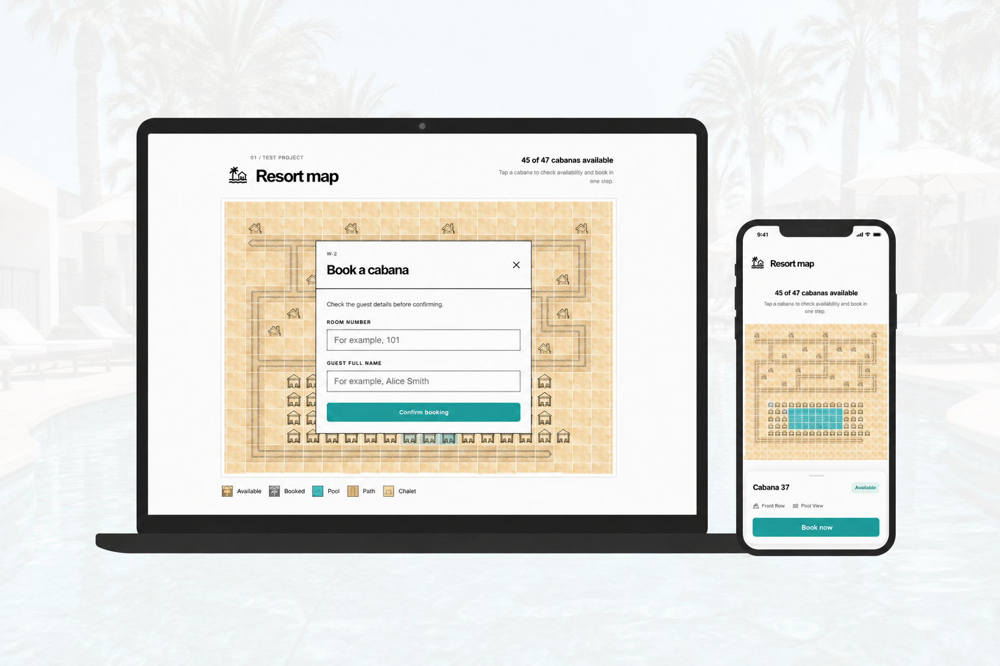
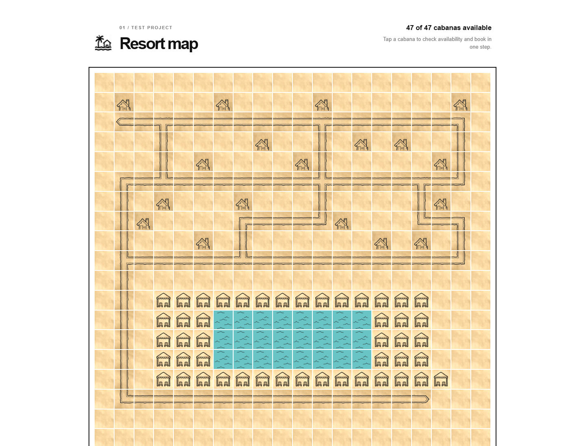

# Resort Map



Interactive resort map and cabana booking test project built with Express, Vanilla JavaScript, and an MVC-like architecture with a dedicated Service Layer (`lib/resort.js`).
The project uses a small Express backend and a Vanilla JavaScript frontend. The browser receives application data through a REST API and does not read the map or guest files directly.

## Stack

- Node.js 18 or newer
- Express 5
- CommonJS JavaScript modules
- REST API with JSON requests and responses
- Vanilla JavaScript, HTML5, and CSS3 frontend
- Bootstrap 5.3.8 from jsDelivr
- `map.ascii` for the resort layout
- `bookings.json` for guest verification
- In-memory `Set` for bookings during the current server process

## Project layout

```text
repository-root/
├── public/
│   ├── static/
│   │   └── assets/                 # Map and transparent PNG assets
│   ├── index.html
│   ├── app.js
│   ├── road.js
│   └── style.css
├── server.js                       # CLI entry point and app.listen()
├── app.js                          # Express middleware and API routes
├── map.ascii                       # ASCII resort map
├── bookings.json                   # Example guest records
├── package.json                    # Scripts and dependencies
├── package-lock.json               # Locked dependency versions
├── lib/
│   └── resort.js                   # Domain and booking service logic
├── screenshot.png                  # Running map view required by the assignment
└── tests/
    └── run-tests.js                # Automated tests
```

Map artwork is stored in `public/static/assets` and is served by Express at `/assets`. Upload the complete repository so the frontend can load the images.

## Screenshot

The required running map view from the assignment is included below:



## Install and run

From the `serv` directory:

```powershell
npm install
```

Do not commit `node_modules`; it is generated locally and ignored by `.gitignore`.

From the repository root:

```powershell
node serv/server.js --map serv/map.ascii --bookings serv/bookings.json
```

Open `http://localhost:3000`.

Or from inside `serv`:

```powershell
npm.cmd start -- --map map.ascii --bookings bookings.json
```

Alternative files can be supplied with `--map <path>` and `--bookings <path>`. The default port is `3000`; use the `PORT` environment variable to change it.

## Architecture and data flow

The project uses a simple layered architecture with MVC-like responsibilities and a Service Layer. It is intentionally not an over-engineered strict MVC application.

```text
server.js
  -> creates and starts Express app
app.js
  -> middleware, static files, REST routes
lib/resort.js
  -> map loading, guest loading, map state, booking rules
public/
  -> HTML, CSS, Vanilla JS, and road rendering
```

`server.js` is the entry point, similar to a Flask `run.py`. It parses CLI arguments, calls `createApp()`, and starts `app.listen()`.

`app.js` is the backend Express application. It configures `express.json()`, serves `public` and maps `public/static/assets` to `/assets`, and defines the REST routes. Route handlers are the backend controller layer.

`lib/resort.js` is the Service/Domain Layer. It reads and validates files, creates tile objects, compares guest data, stores current bookings, and returns map state.

The two files named `app.js` are not duplicates:

- `serv/app.js` runs on Node.js as backend Express code;
- `serv/public/app.js` runs in the browser as frontend Vanilla JavaScript.

## Startup data loading

The server loads input files before it starts listening:

```text
server.js
  -> createApp()
  -> loadMap(map.ascii)
  -> loadBookings(bookings.json)
  -> app.listen()
```

`loadMap()` removes line breaks, checks that all rows have equal width, and accepts only:

```text
W = cabana
p = pool
# = path
c = chalet
. = empty space
```

`loadBookings()` parses and validates the JSON array. If either input file is missing or invalid, startup fails with a readable error. The frontend never reads either file; it requests the prepared result from `GET /api/map`.

## Frontend and backend communication

The browser uses the Fetch API and REST endpoints:

```text
Browser public/app.js
        |
        | GET /api/map
        v
Express app.js
        |
        | resort.getMap()
        v
JSON response
```

For a booking, `public/app.js` sends `POST /api/bookings` with JSON. Express parses `request.body`, the service validates the guest, and the response contains confirmation and the updated map. The frontend renders the returned map without a full page reload.

## Tile rendering

The backend converts every ASCII character into a tile with row, column, symbol, type, cabana ID, and availability. Cabana IDs are assigned left-to-right and top-to-bottom, such as `W-1`.

The frontend creates one HTML element per tile and places them in a CSS Grid. Non-pool tiles use two layers:

- `z-index: 0`: lower parchment sprite-sheet background;
- `z-index: 1`: transparent chalet, cabana, or road PNG.

The parchment sections are:

```text
1 = empty tile
2 = cabana background
3 = chalet background
4 = path background
```

`road.js` checks top, right, bottom, and left neighbours and selects straight, end, corner, split, or crossing assets. Only the transparent road image is rotated, so the lower background remains stable.

## REST API

### Health check

```text
GET /api/health
```

Returns:

```json
{ "ok": true }
```

### Map

```text
GET /api/map
```

Returns map dimensions, legend, tile coordinates, tile types, cabana IDs, and availability.

### Booking

```text
POST /api/bookings
Content-Type: application/json
```

Request:

```json
{
  "cabanaId": "W-1",
  "room": "101",
  "guestName": "Alice Smith"
}
```

Responses are `201` for a successful booking, `400` for invalid input, `403` when the room and name do not match `bookings.json`, and `409` when the cabana is already booked.

Guest names are compared after trimming repeated spaces and ignoring letter case. Room numbers are compared after trimming.

## Storage and current security

Guest records from `bookings.json` are kept in an array. Current cabana bookings are stored in an in-memory `Set`, for example `bookedCabanas.add('W-1')`. Bookings disappear after a server restart because persistent storage is not required.

This is a local educational HTTP application. It does not implement HTTPS, authentication, sessions, rate limiting, a production database, or payment processing. Express limits JSON bodies to 10 KB, rejects malformed JSON, validates input, and serves static files only from configured directories.

Do not send real customer or payment data through the local HTTP server.

## Production security

A client-facing production version must use HTTPS with TLS. TLS encrypts data between the browser and server and protects guest details, authentication data, and payment-related requests from interception. Payment card data should normally be handled by a trusted payment provider and should not be stored by this application.

If a production database is added, use parameterised queries or a safe ORM to prevent SQL injection. Also validate server input, encode dynamic output, use a Content Security Policy to reduce XSS risk, and add CSRF protection when authentication uses cookies. Production should also use secure cookies, `SameSite`, origin checks, password hashing, secret management, rate limiting, security headers, audit logging, backups, and least-privilege database credentials.

## Possible production identity and booking flow

The current demo asks for a room number and guest name from `bookings.json`. This keeps the full-stack example simple and avoids external OAuth credentials and database setup.

A real resort product could require sign-in or registration before booking, offer one-button Google or social login, create a guest account connected to the active stay, show the privacy notice and obtain required data-processing consent, and keep a secure HTTPS session.

After authentication, a booking request could contain only `cabanaId`. The backend would identify the guest from the session, check the active stay and availability, show `Do you want to book cabana W-2?`, and allow later bookings without repeated guest-data entry. Web and Android clients can use the same HTTPS API. A mobile OAuth flow should use authorization-code flow with PKCE rather than collecting a Google password inside an embedded WebView.

This production flow is documented but not implemented in the current minimal demo.

## Performance testing

Use Chrome DevTools with `http://localhost:3000`.

Recommended parameters:

- `No throttling` for the local baseline;
- `Fast 4G` and `Slow 4G` for network testing;
- desktop and mobile viewport;
- one cold-cache and one warm-cache run;
- at least five reloads, comparing median and slowest runs;
- `Disable cache` only for the cold-cache test.

The normal Network flow is `GET /`, Bootstrap CSS, `/style.css`, Bootstrap JavaScript, `/road.js`, `/app.js`, `/api/map`, and `/assets/*`. Record duration, TTFB, transferred size, status code, cache status, failed requests, request count, and total transferred bytes.

The supplied local DevTools measurements were:

```text
LCP: 0.06 seconds
LCP element: h1
CLS: 0.04
Worst cluster: 1 shift
```

These are development measurements. The LCP value shows that the heading rendered quickly; it does not prove that every map image finished loading. CLS `0.04` is a good local result, but cold-cache and mobile runs should also be checked. Additional useful metrics are FCP, DOMContentLoaded, Load event, API response time, image decode time, long tasks over 50 ms, and INP after booking interaction.

## Tests

From `serv`:

```powershell
npm.cmd test
```

From repository root:

```powershell
node serv/tests/run-tests.js
```

The suite covers CLI arguments, map parsing, road asset selection, health API, map API, guest validation, successful booking, map updates, duplicate bookings, and important frontend HTML/CSS/JavaScript contracts. The frontend contract test checks source structure; it is not a full browser E2E test.

## Design decisions and trade-offs

The project intentionally uses a small Express backend and Vanilla JavaScript frontend. This keeps the path from input files to REST response and from a click to a booking easy to follow. Bootstrap is used for modal and responsive utilities, while custom CSS controls the visual style. Map and guest files are loaded once at startup, while bookings are kept in memory. This matches the task but is not suitable for multiple server processes, permanent bookings, real authentication, or payments.

## Related files

- [AI.md](AI.md) — AI-assisted workflow and prompts.
- [task.md](task.md) — original assignment requirements.
